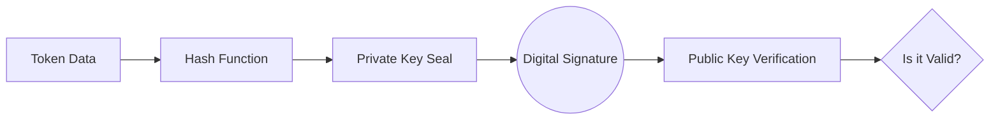

---
## Chapter 1: The Cryptographic Skeleton

In a Zero Trust architecture, we don't trust the network, and we don't trust the client. We only trust **Mathematics**.

### 1.1 Digital Signatures (The Identity Card)

When **Keycloak** or **Ory Hydra** issues a JWT (JSON Web Token), it does not "hide" the data. Anyone can base64-decode the token and see your `username` and `roles`.

The goal of a signature is **Integrity and Authenticity**, not Secrecy.

* **The Math:** The IdP takes the token content, hashes it, and then "seals" that hash using its **Private Key** (typically RSA or ECDSA).
* **The Java 25 Rigor:** Your Java backend uses the IdP's **Public Key** to verify that the seal hasn't been broken. If even a single bit of the "role" field is changed, the math fails.



### 1.2 Encryption (The Locked Box)

Encryption is about **Confidentiality**. We use it when we want to hide data (like a password in a database or a sensitive ScopedValue sent over the wire).

* **Asymmetric:** Using a Public Key to lock and a Private Key to unlock.
* **Symmetric (AES):** Using the same key to both lock and unlock. This is faster and used for bulk data.

---

## 1.3 Implementation: Verifying a Signature to the Bone

In Java 25, we avoid high-level "magic" libraries when we want to ensure absolute rigor. We go straight to `java.security`. Here is how you verify a signature at the byte level.

```java
/**
 * Rigorous Signature Verification using Java 25 Native APIs.
 * This is what happens inside a JWT library.
 */
public boolean verifyIdentity(byte[] data, byte[] signatureBytes, PublicKey publicKey) {
    try {
        // We use SHA256withRSA - The industry standard for OIDC
        // In 2026, we also prepare for ML-DSA (Post-Quantum)
        Signature sig = Signature.getInstance("SHA256withRSA");
        
        // Initialize with the Public Key from Keycloak/Hydra
        sig.initVerify(publicKey);
        
        // Load the data to be verified
        sig.update(data);
        
        // The moment of truth: The CPU performs the modular exponentiation
        // to check if the signature matches the data hash.
        return sig.verify(signatureBytes);
        
    } catch (NoSuchAlgorithmException | InvalidKeyException | SignatureException e) {
        // To the bone: Never ignore these. Log them as potential tampering.
        throw new SecurityException("Cryptographic verification failed", e);
    }
}

```

### Why this matters for the "Deep-Dive"

1. **Memory Safety:** By using `byte[]` and immediate verification, we minimize the time sensitive data stays in the Heap.
2. **Algorithm Rigor:** By explicitly naming `SHA256withRSA`, we prevent **Algorithm Downgrade Attacks** (where an attacker tries to force the server to use a weaker, crackable algorithm like `none` or `MD5`).
3. **Scoped Context:** Once verified, this `UserIdentity` is placed into a `ScopedValue`. This ensures that even if a sub-task is hijacked, the attacker cannot "re-sign" or "forge" a new identity within that execution thread.

---

### Key Takeaway for the Reader

> **Signing** is a seal on the outside of a box. Everyone can see what's inside, but no one can change it without breaking the seal.
> **Encryption** is the box itself being made of lead. No one can see inside unless they have the key.
> **In Identity Fabric, we primarily live and die by Signatures.**

---
